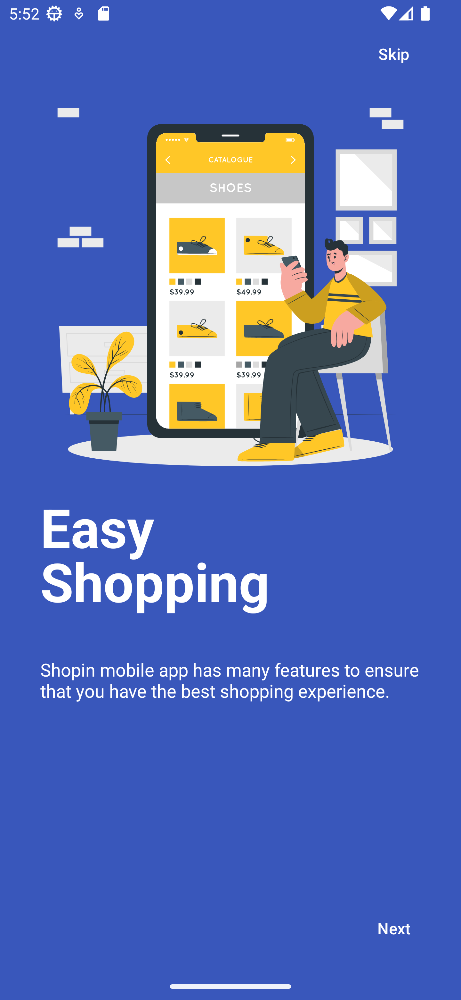
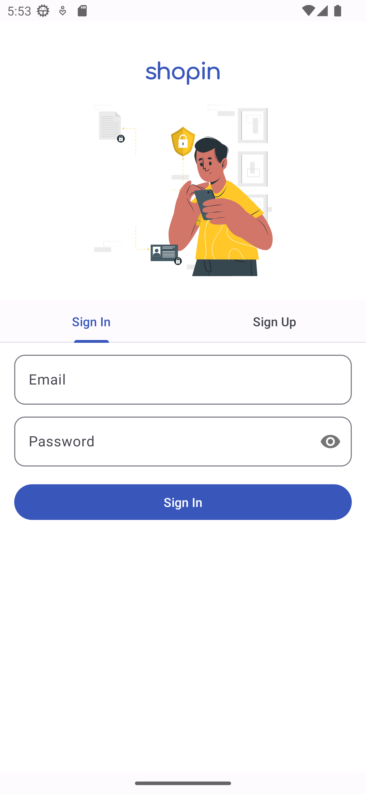
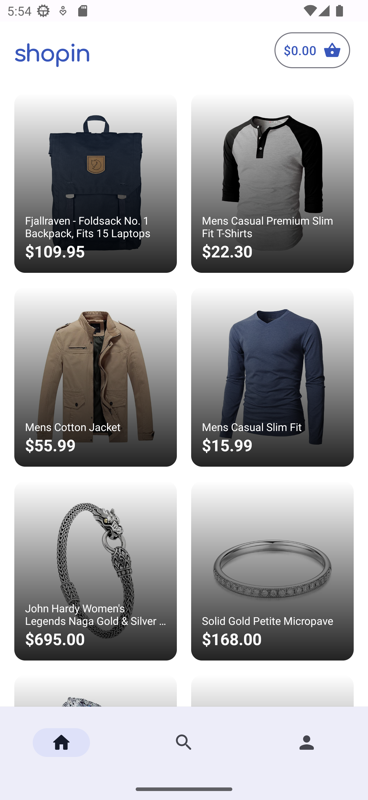
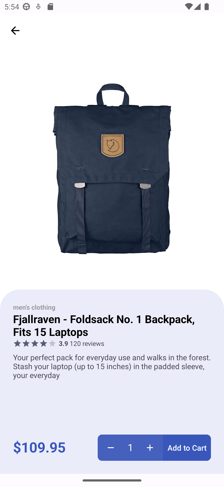
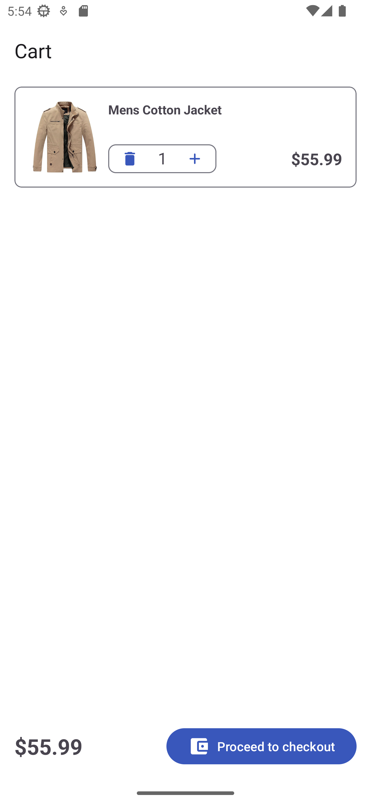
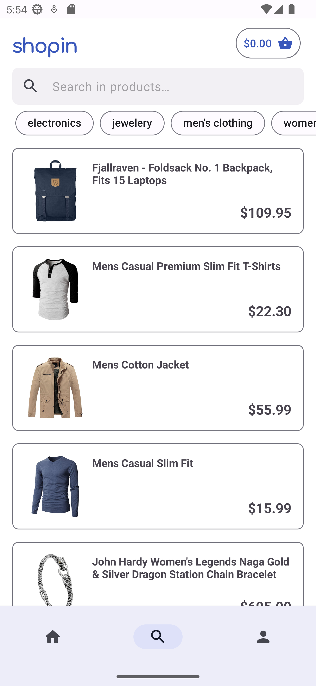
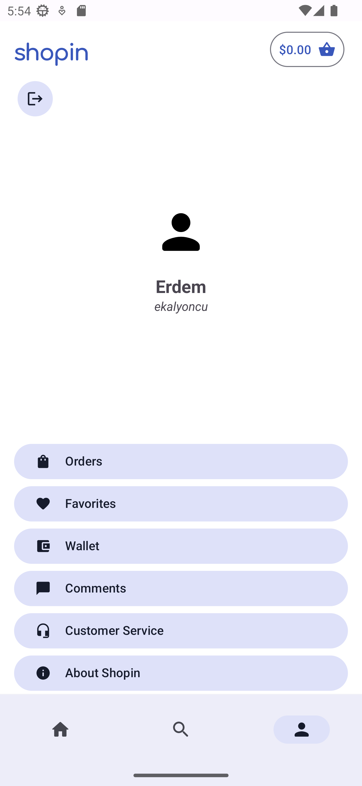

<br/>
<div align="center">
    <a>
        
    </a>
</div>

### 🖼️ Ekran Görüntüleri
<table align="center">
  <tr>
    <td></td>
    <td></td>
    <td></td>
    <td></td>
  </tr>
  <tr>
    <td></td>
    <td></td>
    <td></td>
    <td></td>
  </tr>
</table>


### ℹ️ Proje Hakkında
Shopin, <a href="fakestoreapi.com">Fake Store API</a> verilerini kullanan bir e-ticaret uygulaması prototipidir. Ürünlerin detaylarını incleyebilir, sepetinize ekleyebilir ve ürünler arasında arama ve filtreleme işlemleri yapabilirsiniz.

### 🚀 Geliştirme Süreci
Geliştirme sürecine marka ismini ve kimliğini (renkler, yazı tipi, kullanıcı hedefi vs.) belirleyerek başladım. Oluşturduğum sahte marka doğrultusunda Figma üzerinde UI tasarımlarını çizdim. Uygulama geliştirme sürecinde Git ve Github'ı aktif bir şekilde kullandım. Farklı branch'lerde çalışarak, atomik commit'ler atarak ve branch'leri birleştirmek için Pull request kullanarak çalıştım.

### 💎 Marka Kimliği

<div align="center">
    
    <p align="center"><b>Font Family:</b> Comfortaa</p>
</div>


### 🏗️ Proje Mimarisi

Uygulamada MVVM mimarisi ve Clean Architecture yaklaşımı kullanılmıştır. Aşağıdaki tabloda uygulamada kullandığım dosya yapısını görebilirsiniz.

```
com.erdemklync.shopin
├───data
│   ├───local
│   ├───mapper
│   └───remote
│       ├───entity
│       ├───repository
│       └───service
├───di
├───domain
│   ├───model
│   ├───repository
│   ├───use_cases
│   │   ├───cart
│   │   ├───category
│   │   └───product
│   └───util
├───presentation
│   ├───customview
│   ├───features
│   │   ├───auth
│   │   ├───cart
│   │   ├───main
│   │   ├───on_boarding
│   │   ├───products
│   │   ├───product_detail
│   │   ├───profile
│   │   ├───search
│   │   ├───sign_in
│   │   ├───sign_up
│   │   └───splash
│   └───util
└───util
```

### 🛠️ Araçlar, Kütüphaneler ve Teknolojiler
- [Android Studio Dolphin](https://developer.android.com/studio)
- [Figma](https://figma.com/)
- [Kotlin 1.7.20](https://kotlinlang.org)
- [ViewModel](https://developer.android.com/topic/libraries/architecture/viewmodel)
- [Hilt](https://developer.android.com/training/dependency-injection/hilt-android)
- [Retrofit](https://square.github.io/retrofit)
- [Jetpack DataStore](https://developer.android.com/topic/libraries/architecture/datastore)
- [Coroutines](https://kotlinlang.org/docs/reference/coroutines-overview.html) 
- [StateFlow & SharedFlow](https://developer.android.com/kotlin/flow/stateflow-and-sharedflow)
- [Jetpack Navigation](https://developer.android.com/guide/navigation) 
- [Firebase Authentication & Firestore](https://firebase.google.com)
- [Material You](https://m3.material.io)
- [Glide](https://bumptech.github.io/glide)
- [Shimmer](https://facebook.github.io/shimmer-android/) 

### 📲 Shopin'i deneyin
Projeyi klonlayabilir

```sh
  git clone https://github.com/erdemklync/Shopin.git
```

veya

<a href="https://github.com/erdemklync/Shopin/releases/tag/1.0">buradan</a> APK dosyasını indirebilirsiniz.


### 📧 İletişim

LinkedIn - [linkedin.com/in/erdemkalyoncu](https://linkedin.com/in/erdemkalyoncu)<br />
Medium - [medium.com/@erdemklync](https://medium.com/@erdemklync)<br />
YouTube - [youtube.com/c/ErdemKalyoncu](https://www.youtube.com/c/ErdemKalyoncu)<br />

Diğer projelerim için: [https://github.com/erdemklync](https://github.com/erdemklync)
